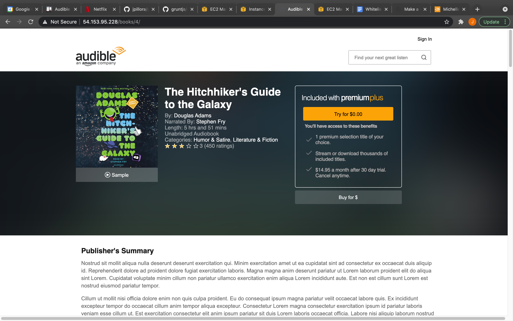

# Audible Product Page

[public ip](http://ec2-54-153-95-228.us-west-1.compute.amazonaws.com/books/2/)

#### Screenshots of Page:

## Desktop View

### Title Bar

<a href="url"></a>
   

### Aggregate Reviews

1. 

### Reviews

1. 

Phone View:
Phone View Title Bar:
![media view] (https://drive.google.com/file/d/1Jqg6Vo4ZnrtEifza09-cc6b4sKuJuHZv/view?usp=sharing)
Phone View aggregate Reviews:
![aggregate Reviews] (https://drive.google.com/file/d/1_GUSGGxqTZBHGLyIGU61k9h83z8ZKbYE/view?usp=sharing)
Phone View Reviews:
![reviews] (https://drive.google.com/file/d/1pgPxPTY7m6z8epMRLhMWMlUrtDAr_MGm/view?usp=sharing)
Phone View Reviews:
![reviews show more button] (https://drive.google.com/file/d/1AccBtNXao5VYOf4CXzCmi5HckHtoy_k_/view?usp=sharing)

Gifs of Page in Desktop View:
Title Bar Gif:
.gif =250x250)
Title Bar Page:
![giph of scrolling on page desktop view] (https://media.giphy.com/media/uLHcWxOAYjxqMEhU7E/giphy.gif)
Title Bar Reviews:
![giph of reviews options] (https://media.giphy.com/media/5NIkRcEejinVdsLu66/giphy.gif)

Gifs of Page in Phone View:
Title Bar Phone View Gif:
![giph of title and summary ] (https://media.giphy.com/media/7c96YgQhUeWWqbrDBe/giphy.gif)
![giph of reviews options] (https://media.giphy.com/media/7raLc5HerSyLvqUuPG/giphy.gif)
![] ()


It routes calls from the services:
1. Title Service
1. Price Service
1. Summary Service
1. Aggregate Reviews Service
1. Reviews Service

* Requirements

This project require node_modules which can be installed by running *npm install*.

Dependencies
    "@readme/markdown": "^6.27.1",
    "axios": "^0.21.1",
    "default": "^0.1.1",
    "grunt": "^1.4.0",
    "nodemon": "^2.0.7",
    "path": "^0.12.7"

Dev Depenencies
    "grunt-aws": "^0.7.1",
    "grunt-contrib-jshint": "^3.0.0",
    "grunt-s3": "^0.2.0-alpha.3",
    "request": "^2.88.2"

Requires file 'grunt-aws.json' in root with format
{
  key: "<aws key>",
  secret: "<secret aws key>",
  bucket: "<name of s3 bucket>"
}


* Recommended modules
* Installation
* Configuration
* Troubleshooting
* FAQ
* Maintainers


# Audible Product Page

Foobar is a Python library for dealing with word pluralization.

## Installation

Use the package manager [pip](https://pip.pypa.io/en/stable/) to install foobar.

```bash
pip install foobar
```

## Usage

```python
import foobar

foobar.pluralize('word') # returns 'words'
foobar.pluralize('goose') # returns 'geese'
foobar.singularize('phenomena') # returns 'phenomenon'
```

## Contributing
Pull requests are welcome. For major changes, please open an issue first to discuss what you would like to change.

Please make sure to update tests as appropriate.

## License
[MIT](https://choosealicense.com/licenses/mit/)